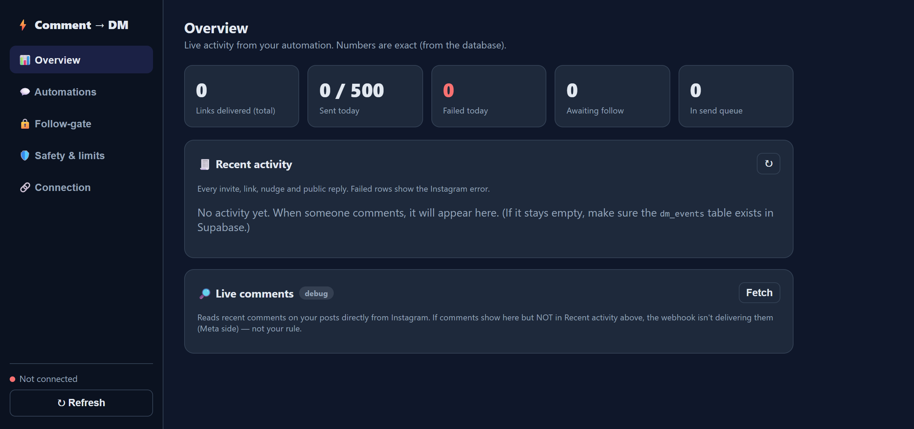
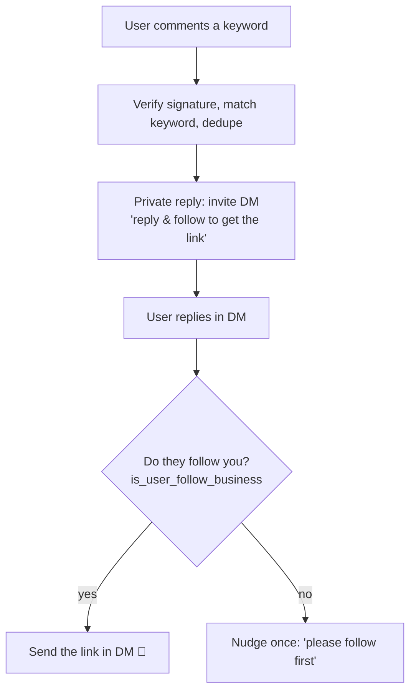
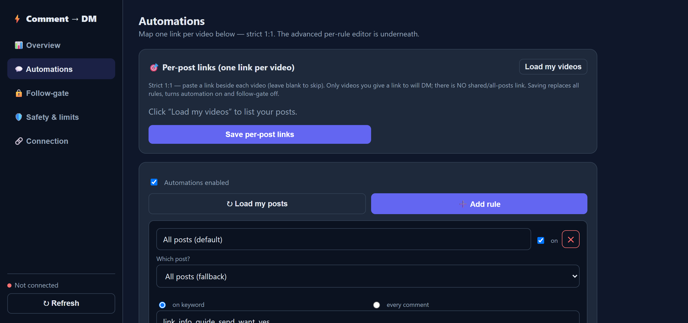

# Comment → DM (Instagram automation)

[](LICENSE)
[](package.json)
[](#contributing)

Automatically send a link in a **DM** when someone **comments** on your Instagram
post or reel — built entirely on the **official Instagram API** (the *Private
Replies* feature). No scraping, no browser bots, no unofficial endpoints, so it
stays within Instagram's Platform Terms.

> Inspired by the open‑source [insta‑p8 / InstaAuto](https://github.com/ayuuxh2/insta-p8)
> project, but trimmed down to one focused, easy‑to‑audit flow: **comment → DM**.

If this saves you the pain of wrangling the Instagram Graph API yourself,
**⭐ star the repo** — and see [Contributing](#contributing) if you'd like to help
improve it.



### Contents

- [How it works](#how-it-works)
- [Requirements](#requirements)
- [Quick start (local)](#quick-start-local) — install → tunnel → configure → run → test, ~5 minutes
- [Configuration](#configuration-the-automation)
- [Environment variables](#environment-variables)
- [Deploy](#deploy)
- [Staying within Instagram's rules](#staying-within-instagrams-rules)
- [Troubleshooting](#troubleshooting)

---

## How it works

There are two modes. By default the **follow-gate** is on.

**Follow-gate (two-step, verifies the follow):**



**Direct mode (follow-gate off):** comment → immediately DM the link via a
private reply.

> **Why two steps?** Instagram has **no API to check if a commenter follows you
> at comment time** — the follow field (`is_user_follow_business`) requires the
> user to have messaged you first (*"User consent is required to access the user
> profile"*). So the only compliant way to verify a follow is to invite them to
> DM, then check once they reply.

The link DM is sent using Instagram's official **Private Replies** endpoint
(direct mode) or the messaging endpoint (after a reply):

```http
POST https://graph.instagram.com/v21.0/me/messages
Authorization: Bearer <INSTAGRAM_USER_ACCESS_TOKEN>
Content-Type: application/json

{ "recipient": { "comment_id": "<COMMENT_ID>" }, "message": { "text": "..." } }
```

Instagram allows **one** private reply per comment, within **7 days**. That
single-reply limit, plus the safeguards below, are why this is compliant.

### Built-in anti-spam (important for high-traffic posts)

Every outbound message goes through a single rate-limited queue:

- **Global rate limit** — max sends per rolling minute.
- **Daily cap** — max link DMs per UTC day (0 = unlimited).
- **Only once per user** — a person never gets the link twice, across any post.
- **Randomized delay** — a short, human-like pause before each send.
- **Dedupe** — webhook retries never cause duplicate messages.

Tune all of these in the dashboard (**Safety & limits**) or via the API. Live
counters (delivered, sent today, pending, queue depth) are on the dashboard.

---

## Requirements

- An Instagram **Business** or **Creator** account.
- A **Meta developer app** with *Instagram → API setup with Instagram login*.
- **Node.js 18.17+**.
- A public **HTTPS** URL for webhooks (a tunnel like [ngrok](https://ngrok.com)
  / [Cloudflare Tunnel](https://developers.cloudflare.com/cloudflare-one/connections/connect-networks/)
  for local dev, or a deployed server).

---

## Quick start (local)

**~5 minutes, 6 steps:**

- [ ] 1. `npm install`
- [ ] 2. Expose `localhost:3000` over HTTPS (ngrok / Cloudflare Tunnel)
- [ ] 3. Copy `.env.example` → `.env` and fill in the values
- [ ] 4. Point the Meta App Dashboard at your tunnel URL (redirect URI + webhook)
- [ ] 5. `npm run dev`
- [ ] 6. Open the dashboard, connect Instagram, save your automation

Details for each step below.

### 1. Install

```powershell
npm install
```

### 2. Expose your local server over HTTPS

```powershell
# example with ngrok — copy the https URL it prints
ngrok http 3000
```

### 3. Configure environment

Copy `.env.example` to `.env` and fill it in. The important ones:

```ini
PUBLIC_BASE_URL=https://<your-tunnel>.ngrok-free.app
ADMIN_TOKEN=<a long random string>
INSTAGRAM_APP_ID=<from Meta app>
INSTAGRAM_APP_SECRET=<from Meta app>
INSTAGRAM_REDIRECT_URI=https://<your-tunnel>.ngrok-free.app/auth/callback
WEBHOOK_VERIFY_TOKEN=<any string you choose>
```

### 4. Configure the Meta app

In the [Meta App Dashboard](https://developers.facebook.com/apps) → your app →
**Instagram** → **API setup with Instagram login**:

1. **Business login settings**
   - Add an **OAuth redirect URI** that matches `INSTAGRAM_REDIRECT_URI` exactly,
     e.g. `https://<your-tunnel>.ngrok-free.app/auth/callback`.
2. **Configure webhooks**
   - **Callback URL:** `https://<your-tunnel>.ngrok-free.app/webhook`
   - **Verify token:** the same value as `WEBHOOK_VERIFY_TOKEN`.
   - Subscribe to the **`comments`** field.
3. **Permissions** — make sure these three scopes are requested/approved:
   - `instagram_business_basic`
   - `instagram_business_manage_messages`
   - `instagram_business_manage_comments`

> The dashboard shows you the exact Callback URL, Verify token and Redirect URI
> to paste (step **2** in the UI), so you don't have to guess.

### 5. Run

```powershell
npm run dev      # watch mode
# or
npm run build; npm start
```

> **Before deploying publicly:** `public/privacy.html` and `public/terms.html`
> ship with placeholder contact details (`you@example.com`) — replace them with
> your own before going live; Meta requires working privacy/terms links for
> production API access.

Open **http://localhost:3000**, paste your `ADMIN_TOKEN` to unlock, then:

1. **Connect Instagram** → log in and approve. The app stores a long‑lived token
   and auto‑subscribes your account to the `comments` webhook.
2. **Set your automation** → keyword(s), the link, the DM text, and (optionally)
   a public "check your DMs" reply. Save.

### 6. Test

Comment one of your trigger keywords (e.g. `link`) on your own post from a
**different** Instagram account. You should receive the DM with your link, and
(if enabled) a public reply on the comment.

You can also click **Test** on the `comments` webhook in the Meta dashboard to
send a sample event and watch it flow through the server logs.

---

## Configuration (the automation)

Everything below is editable from the dashboard and stored in `data/store.json`.



### Per-post rules — "which video → which link"

Every comment webhook includes the **post/reel ID** it came from (`media.id`).
You create one **rule per video**, each with its own trigger + link. On the
dashboard, click **Load my posts** to pick a specific video (or paste its ID).

- A rule tied to a **specific post** only fires for that post — and **wins** over
  a catch-all rule.
- A rule with **All posts** (empty media) is the fallback for anything else.
- The link is captured when the comment arrives and delivered after the follow
  is verified, so each person gets the link for the exact video they commented on.

| Rule setting | Meaning |
| --- | --- |
| **Name** | Optional label for the rule. |
| **On / off** | Enable/disable just this rule. |
| **Which post** | The post/reel this rule targets, or *All posts (fallback)*. |
| **Trigger** | `on keyword` (comment must contain a keyword) or `every comment`. |
| **Keywords** | Comma‑separated, case‑insensitive substrings. |
| **Link** | The link to send for this post. |
| **DM message** | The DM text that carries the link. |
| **Public reply** | Optional comment reply, e.g. "Just sent you a DM 📩". |

### Global settings (apply to every rule)

| Setting | Meaning |
| --- | --- |
| **Enabled** | Master on/off switch for all automations. |
| **Require follow** | Two-step follow-gate: verify the follow before sending the link. |
| **Invite DM** | Sent as the private reply on the comment when the follow-gate is on. |
| **Nudge DM** | Sent once if the user replies but isn't following yet. |
| **Only once per user** | Never send the link to the same person twice. |
| **Max sends / minute** | Global outbound rate limit. |
| **Max link DMs / day** | Daily cap (UTC); `0` = unlimited. |
| **Min / max delay** | Randomized pause (seconds) before each send. |

---

## Environment variables

| Variable | Required | Description |
| --- | --- | --- |
| `PORT` | – | Server port (default `3000`). |
| `PUBLIC_BASE_URL` | ✅ | Public HTTPS URL of this server (no trailing slash). |
| `ADMIN_TOKEN` | ✅ | Protects the dashboard + `/api`. Use a long random string. |
| `INSTAGRAM_APP_ID` | ✅ | Instagram app ID (not the Meta/Facebook app ID). |
| `INSTAGRAM_APP_SECRET` | ✅ | Instagram app secret. |
| `INSTAGRAM_REDIRECT_URI` | ✅ | OAuth redirect URI; must match the Meta dashboard. |
| `INSTAGRAM_SCOPES` | – | Defaults to the three scopes above. |
| `WEBHOOK_VERIFY_TOKEN` | ✅ | Your webhook verify string. |
| `WEBHOOK_FIELDS` | – | Subscribed fields (default `comments,messages`; `messages` is needed for the follow-gate reply). |
| `WEBHOOK_SKIP_SIGNATURE` | – | `true` disables signature checks — **local testing only**. |
| `GRAPH_API_VERSION` | – | Graph API version (default `v21.0`). |
| `DATA_DIR` | – | Where `store.json` lives (default `data`). |
| `LOG_LEVEL` | – | `debug` / `info` / `warn` / `error`. |

Never expose `INSTAGRAM_APP_SECRET`, `ADMIN_TOKEN`, or the stored access token in
client-side code. The dashboard only ever reads status — the token stays server‑side.

---

## Deploy

### Option A — always-on host (simplest: Render, Railway, Fly.io, a VPS)

Runs the code as-is, including the smooth rate-limiter and background jobs.

1. Set all environment variables (use the production HTTPS domain).
2. `npm install && npm run build && npm start`.
3. In the Meta dashboard, set the production **redirect URI** and **webhook
   callback URL** to your domain.
4. Open your domain, unlock with `ADMIN_TOKEN`, connect Instagram, save your rules.

### Option B — Vercel (serverless)

The repo is Vercel-ready (`vercel.json` + `api/index.ts`). Because Vercel is
serverless, storage and background jobs are handled a bit differently:

1. **Import the repo** into Vercel.
2. **Add storage:** in the project's **Storage** tab, add an **Upstash Redis**
   (KV) integration. It sets `KV_REST_API_URL` + `KV_REST_API_TOKEN`
   automatically — required so your token/config/rules persist.
3. **Add environment variables** (Project → Settings → Environment Variables):
   `ADMIN_TOKEN`, `INSTAGRAM_APP_ID`, `INSTAGRAM_APP_SECRET`,
   `INSTAGRAM_REDIRECT_URI` (= `https://<your-app>.vercel.app/auth/callback`),
   `WEBHOOK_VERIFY_TOKEN`, `PUBLIC_BASE_URL` (= `https://<your-app>.vercel.app`),
   and a random `CRON_SECRET`.
4. **Deploy.** Then in the Meta dashboard set the redirect URI and webhook
   callback URL (`https://<your-app>.vercel.app/webhook`) to your Vercel domain.
5. Open your Vercel URL, unlock with `ADMIN_TOKEN`, connect Instagram, add rules.

The included **Vercel Cron** (`/api/cron`, daily) refreshes the token and clears
stale pending invites.

> **Serverless trade-off:** on Vercel the per-minute pacing and randomized delay
> are skipped (they can't span invocations / would risk function timeouts); the
> **daily cap, once-per-user, dedupe, and follow-gate still apply**. For the
> smoothest pacing under a viral spike, Option A (always-on) is recommended.

> Without an Upstash/KV integration, a Vercel deploy falls back to `/tmp`, which
> is **ephemeral** — your connected account would be lost on the next cold start.

---

## Staying within Instagram's rules

This project is built around Instagram's own compliant mechanism and bakes in
several safeguards:

- ✅ **Official API only** — Instagram API with Instagram Login + Private Replies.
  No scraping, no headless browsers, no unofficial/private endpoints.
- ✅ **User‑initiated** — a DM is only ever sent in response to a real comment.
- ✅ **One reply per comment**, within the **7‑day** window (Instagram enforces this too).
- ✅ **Deduplication** — webhook retries never cause a second DM.
- ✅ **No self‑messaging / loops** — comments from your own account are ignored.
- ✅ **Signature verification** — every webhook is validated with `X-Hub-Signature-256`.
- ✅ **CSRF‑protected OAuth** with a `state` parameter.

Please also:

- Keep messages **helpful and non‑spammy**, and honour opt‑outs.
- **Disclose automation** where required (the default DM text does this). See Meta's
  [automated experience policy](https://developers.facebook.com/docs/messenger-platform/policy).
- Remember production requires **Advanced Access** for the comment/messaging
  permissions, your app set to **Live**, a **public** account, and Business
  Verification. See the [Instagram Platform docs](https://developers.facebook.com/docs/instagram-platform).

This tool does not, and must not, be used to mass‑DM, deceive, or evade rate limits.

---

## Project structure

```
src/
  index.ts                 Local/always-on server bootstrap (listen + timers)
  app.ts                   Builds the Express app (routes + admin API) — shared
  config.ts                Env loading + validation
  logger.ts                Tiny leveled logger
  jobs.ts                  Token refresh + maintenance (used by timers and cron)
  persistence.ts           Storage backend: Upstash Redis (KV) or JSON file
  store.ts                 State (account, config, dedupe, pending, delivered, daily cap)
  sender.ts                Rate-limited send queue (per-minute + daily cap + delay)
  types.ts                 Shared types
  instagram/
    client.ts              Graph API calls (OAuth, subscribe, private reply, DM, user profile)
    oauth.ts               /auth/callback + CSRF state
    webhook.ts             /webhook verify + signed comments & messages handling
  automation/
    engine.ts              Comment → DM decision, follow-gate, queue routing
api/
  index.ts                 Vercel serverless entry (exports the Express app)
public/
  index.html               Dashboard (connect + configure + live stats)
vercel.json                Vercel routing, function config, and daily cron
```

## API endpoints

| Method & path | Auth | Purpose |
| --- | --- | --- |
| `GET /webhook` | Meta verify token | Webhook verification handshake. |
| `POST /webhook` | HMAC signature | Receives `comments` + `messages` events. |
| `GET /auth/callback` | OAuth `state` | Instagram OAuth redirect. |
| `GET /api/status` | Admin bearer | Connection + config + webhook values. |
| `GET /api/connect` | Admin bearer | Returns the Instagram authorize URL. |
| `POST /api/subscribe` | Admin bearer | Re‑subscribe the account to webhooks. |
| `GET /api/media` | Admin bearer | Lists your recent posts (for the rule post‑picker). |
| `POST /api/config` | Admin bearer | Update the automation (rules + global settings). |
| `POST /api/disconnect` | Admin bearer | Remove the connected account. |
| `GET /health` | – | Liveness check. |

---

## Troubleshooting

- **Webhook verification fails** — `WEBHOOK_VERIFY_TOKEN` must match the Meta
  dashboard exactly, and the callback URL must be reachable over HTTPS.
- **`401` on webhook POST** — signature mismatch. Confirm `INSTAGRAM_APP_SECRET`
  is correct. For local testing you can set `WEBHOOK_SKIP_SIGNATURE=true`.
- **No comment webhooks arrive** — the account must be **public**, the app **Live**,
  and (for production) have **Advanced Access** for `instagram_business_manage_comments`.
- **DM not delivered** — check server logs; the API error (window expired, missing
  permission, already replied) is logged with details.
- **OAuth "Invalid state"** — the connect link expired (10 min). Click *Connect* again.

## Contributing

Issues and PRs are welcome — bug fixes, docs, and small focused features
especially. For anything larger (new provider, new send channel, storage
backend), open an issue first to align on the approach before writing code.

```powershell
npm install
npm run typecheck   # must pass before opening a PR
npm run dev
```

## License

[MIT](LICENSE) © 2026 Rikin Shah
